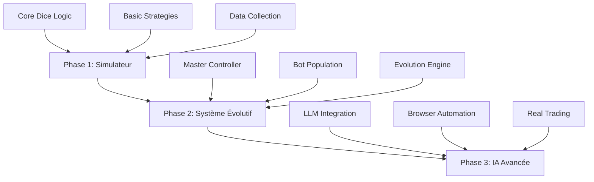

# Spécifications Techniques DiceBot

## Architecture Proposée

### 1. Approche Modulaire Progressive



### 2. Structure de Données

#### Bot Genome
```python
@dataclass
class BotGenome:
    # Paramètres de base
    base_bet: float          # Mise de base (% du bankroll)
    multiplier_preference: float  # Multiplicateur préféré
    
    # Gestion du risque
    stop_loss: float         # % de perte max
    take_profit: float       # % de gain visé
    max_consecutive_losses: int
    
    # Comportement
    aggressiveness: float    # 0.0 (conservateur) à 1.0 (agressif)
    adaptability: float      # Vitesse d'adaptation aux patterns
    memory_weight: float     # Importance donnée à l'historique
    
    # Stratégie
    strategy_genes: Dict[str, float]  # Poids des différentes stratégies
    mutation_rate: float     # Taux de mutation pour l'évolution
```

#### Session Data
```python
@dataclass
class GameSession:
    session_id: str
    bot_id: str
    timestamp: datetime
    
    # Résultats
    total_bets: int
    wins: int
    losses: int
    profit: float
    max_drawdown: float
    
    # Décisions
    decisions: List[BetDecision]
    patterns_detected: List[Pattern]
    emotional_state: Dict[str, float]  # Si on implémente l'aspect émotionnel
```

### 3. Contraintes Techniques - Provably Fair

#### Contrainte de Nonce Séquentiel

Le système Provably Fair de Bitsler impose une contrainte critique :

```python
# Contrainte : Chaque nonce DOIT être utilisé séquentiellement
# Impossible de "sauter" un nonce (0, 1, 2, 3... sans interruption)

# Actions alternatives sans consommer de nonce :
ACTIONS_SANS_NONCE = [
    "toggle_bet_type",     # Change UNDER/OVER
    "change_seed",         # Rotation de seed (reset nonce à 0)
]

# Gestion dans BetDecision
@dataclass
class BetDecision:
    amount: Decimal
    multiplier: float
    bet_type: BetType = BetType.UNDER
    skip: bool = False
    action: str | None = None  # Actions alternatives
```

#### Implémentation ParkingStrategy

```python
# Stratégie spécialisée pour gérer la contrainte
class ParkingStrategy(BaseStrategy):
    """
    - Toggle UNDER/OVER jusqu'à max_toggles
    - Rotation de seed si nécessaire
    - Paris parking minimum (99% chance) quand forcé
    - Wrapper pour toute stratégie existante
    """
```

### 3. Composants Techniques

#### Simulateur (Phase 1)
```python
# Structure principale
simulator/
├── __init__.py
├── core/
│   ├── dice_engine.py      # Moteur de jeu principal
│   ├── random_generator.py # Générateur avec seed contrôlé
│   └── validators.py       # Validation des paris
├── strategies/
│   ├── base_strategy.py    # Classe abstraite
│   ├── martingale.py
│   ├── fibonacci.py
│   └── custom_strategies.py
├── analysis/
│   ├── statistics.py       # Calculs statistiques
│   ├── visualizer.py       # Graphiques et tableaux
│   └── reporter.py         # Génération de rapports
└── data/
    ├── collector.py        # Collecte de données
    └── storage.py          # Interface DB
```

#### Système Évolutif (Phase 2)
```python
# Architecture Master-Slave
evolutionary/
├── master/
│   ├── orchestrator.py     # Coordinateur principal
│   ├── tournament.py       # Gestion des tournois
│   └── evolution_engine.py # Algorithmes génétiques
├── bots/
│   ├── bot_factory.py      # Création de bots
│   ├── bot_instance.py     # Instance individuelle
│   └── behavior.py         # Comportements
└── memory/
    ├── individual_memory.py # Mémoire par bot
    ├── collective_memory.py # Base partagée
    └── pattern_library.py   # Patterns reconnus
```

### 4. Algorithmes Clés

#### Évolution Darwinienne
```python
def evolve_population(population: List[Bot], results: Dict[str, Performance]):
    # 1. Évaluation
    sorted_bots = sort_by_fitness(population, results)
    
    # 2. Sélection
    survivors = sorted_bots[:len(population)//2]
    
    # 3. Reproduction
    offspring = []
    for i in range(0, len(survivors), 2):
        child1, child2 = crossover(survivors[i], survivors[i+1])
        offspring.extend([mutate(child1), mutate(child2)])
    
    # 4. Nouvelle génération
    return survivors + offspring
```

#### Mémoire Collective
```python
class CollectiveMemory:
    def __init__(self):
        self.experiences = []
        self.patterns = {}
        self.strategies = {}
    
    def add_experience(self, exp: Experience):
        # Ajouter et analyser
        self.experiences.append(exp)
        self._extract_patterns(exp)
    
    def query(self, context: GameContext) -> List[Advice]:
        # Rechercher des expériences similaires
        similar = self._find_similar_contexts(context)
        return self._generate_advice(similar)
```

### 5. Intégration IA (Phase 3)

#### LLM Local
```python
# Utilisation d'Ollama ou LlamaCpp
class LLMStrategy:
    def __init__(self, model_name: str):
        self.llm = OllamaModel(model_name)
    
    def analyze_situation(self, game_state: GameState) -> Decision:
        prompt = self._build_prompt(game_state)
        response = self.llm.generate(prompt)
        return self._parse_decision(response)
```

#### Browser Automation
```python
# MCP Playwright
class BitslerBot:
    def __init__(self):
        self.browser = None
        self.page = None
    
    async def connect(self):
        self.browser = await playwright.chromium.launch()
        self.page = await self.browser.new_page()
        await self.page.goto("https://www.bitsler.com")
    
    async def place_bet(self, amount: float, multiplier: float):
        # Automatisation des actions
        await self.page.fill("#bet-amount", str(amount))
        await self.page.fill("#multiplier", str(multiplier))
        await self.page.click("#roll-button")
```

## Stack Technologique Recommandée

### Backend
- **Python 3.11+** : Langage principal
- **FastAPI** : API REST pour le master
- **SQLAlchemy** : ORM pour la persistance
- **Celery** : Tâches asynchrones
- **Redis** : Cache et queues

### Frontend (Dashboard)
- **Streamlit** : Prototypage rapide
- **Plotly/Dash** : Visualisations avancées
- **React** : Interface production (optionnel)

### Data & ML
- **Pandas** : Analyse de données
- **NumPy** : Calculs numériques
- **Scikit-learn** : ML classique
- **Ollama** : LLM local

### Infrastructure
- **Docker** : Conteneurisation
- **PostgreSQL** : Base de données principale
- **MinIO** : Stockage objets (logs, modèles)

## Roadmap de Développement

### Sprint 1 (2 semaines)
- [ ] Setup projet et environnement
- [ ] Core dice engine
- [ ] Stratégies de base (Martingale, Fibonacci)
- [ ] CLI simple pour tests

### Sprint 2 (2 semaines)
- [ ] Système de simulation batch
- [ ] Collecte et stockage de données
- [ ] Dashboard basique (Streamlit)
- [ ] Premières analyses statistiques

### Sprint 3 (3 semaines)
- [ ] Architecture Master-Slave
- [ ] Algorithme génétique basique
- [ ] Première génération de bots
- [ ] Système de tournois

### Sprint 4 (3 semaines)
- [ ] Mémoire collective
- [ ] Comportements émergents
- [ ] Optimisation des performances
- [ ] Tests intensifs

### Sprint 5 (4 semaines)
- [ ] Intégration LLM
- [ ] Browser automation
- [ ] Mode production
- [ ] Documentation complète
